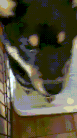
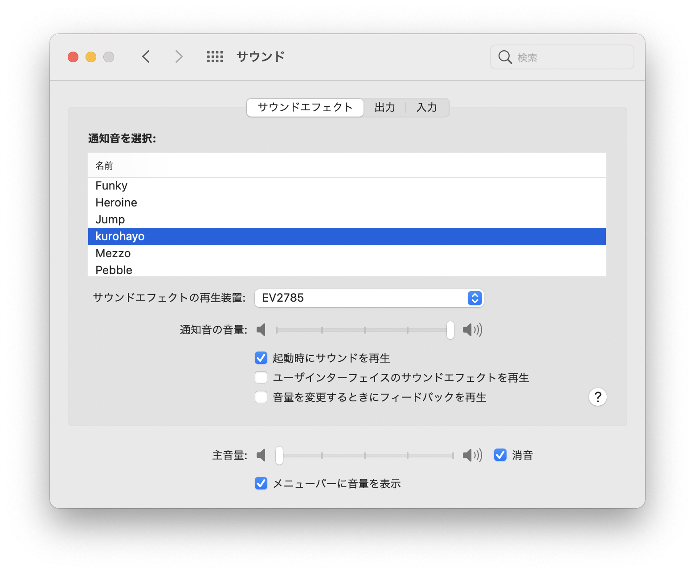

# Sound Effects

My puppy "Kurosuke” says, “Ohayo."

## Download

- [AIFF](kurohayo.aiff)
- [MP3](kurohayo.mp3)

## How to use

### Setting for Mac

1. Add `aiff` file to `~/Library/Sounds/`
2. Select sound at `Preference > Sounds > Sound Effects`

